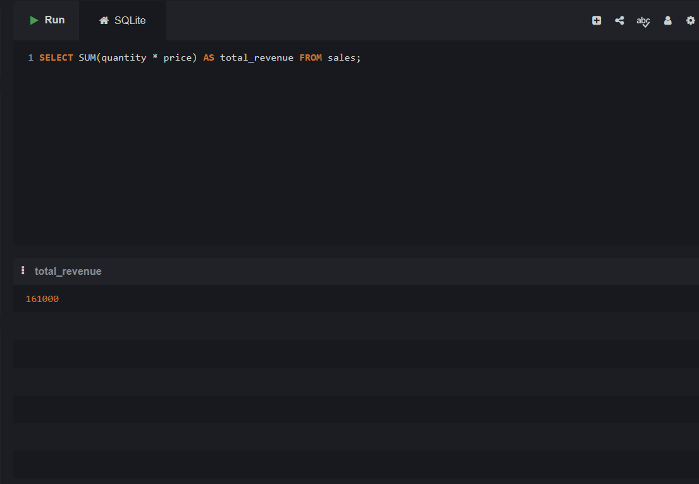
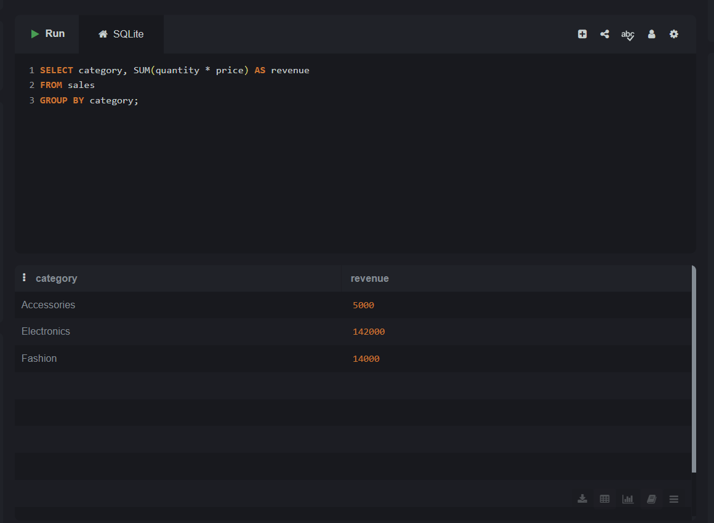
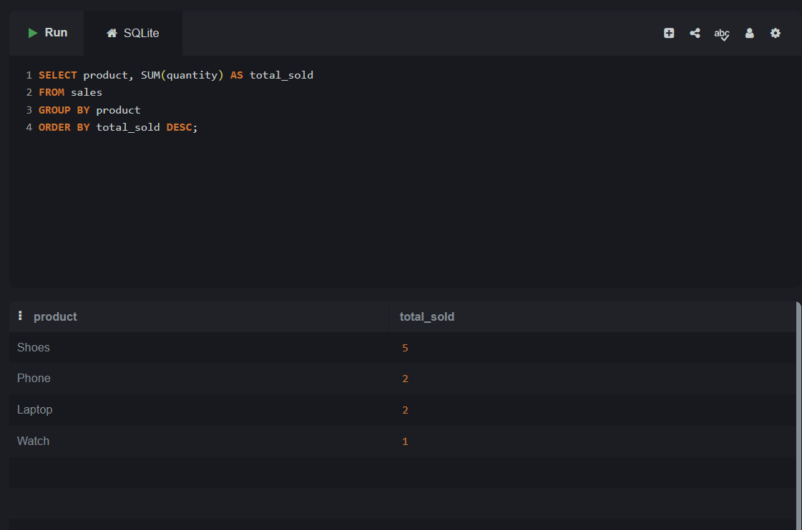

# 📊 SQL Sales Data Analysis

## 📌 Overview
This project analyzes sales data using SQL to generate business insights such as revenue trends and product performance.

## 🛠 Tools Used
- SQL (SQLite)

## 📊 Dataset
The dataset contains:
- Customer Name
- Product
- Category
- Quantity
- Price
- Order Date

## 🔍 Analysis Performed
- Total Revenue Calculation
- Category-wise Revenue Analysis
- Top Selling Product
- Monthly Sales Trend Analysis

## 📈 Key Insights
- Electronics generated the highest revenue
- Laptop is the highest value product
- Fashion category has high volume sales
- Sales show growth trend over months

## 📸 Screenshots

### Total Revenue

### Category Analysis

### Top Product

## 🚀 Author
**Yougesmita Panigrahi**
